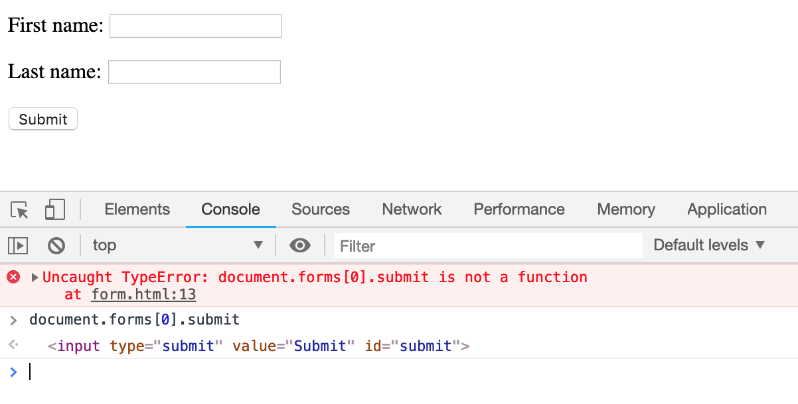

# Form表单中的`submit`陷阱

HTML中form表单自身具备submit()提交表单方法。然而，某些特殊情况下，submit方法无法正常使用。

-------

### 代码陷阱
```javascript
<form action="form_action.asp" method="get">
  	<p>a: <input type="text" name="a" /></p>
  	<p>b: <input type="text" name="b" /></p>
  	<input type="submit" value="Submit" id="submit"/>
</form>
```
此时运行js代码`document.forms[0].submit()`，出乎意料地报错，报错信息更是匪夷所思：`Uncaught TypeError: document.forms[0].submit is not a function`。form表单的submit不是一个方法函数？？！！

-------

### 分析原因
查阅资料后得知了方法函数失踪的真正原因：[资料](https://stackoverflow.com/questions/7684271/submit-is-not-a-function-in-js) 中提到

> Form elements get added as properties to the form object using their names, so that shadows (overrides) the form's built-in submit property (which is the function you're looking for).

**表单元素会以它们的`name`作为属性名称添加到表单对象中**，所以（如果你曾用‘submit’作为表单元素的name值）重写了表单对象原本内置的‘submit’方法（也就是覆盖了你原本想要使用的submit提交方法事件），那么表单元素的submit自然就不再是原来的方法函数了。

-------

### 总结
表单元素的名称也是有雷点的，需要小心避免踩坑。在示例代码中，submit到底被谁覆盖了？打印一下submit的值，一眼就明白了。

原来那个id为submit的input元素，替换掉了表单原本的submit方法。这时如果把id替换成其他的名称，就可以正常提交了。妥！

类似的`<input type="button" name="submit" />`，也会导致都表单原本的submit方法无法正常使用。
anyway，一句话总结，我们的目标是：好好学英语，命名不尴尬！


