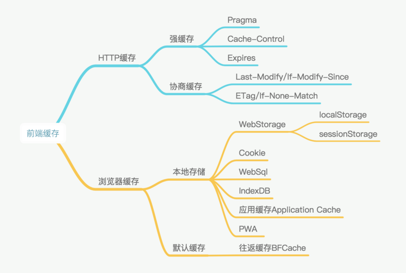

# Web页面中的缓存

## 1. 概述
* HTTP缓存在请求传输时使用，主要在服务器端代码设置。
* 浏览器缓存在前端js代码中设置。

    
## 2. 描述
### 2.1 HTTP缓存
在第一次返回资源的请求response header中设置，非初次请求，会先判断这些参数作出响应。区别如下

 缓存类型 | 状态码 | 缓存位置 | 处理程序 | 其他
---------|--------|---------|---------|-------
 强缓存   | 200   | 浏览器   | 浏览器   | F5刷新无效，Ctrl+F5刷新无效
 协商缓存 | 304   | 浏览器   | 服务器   | F5刷新有效，Ctrl+F5刷新无效
 
**备注：** [F5刷新和F5+Ctrl刷新的区别](https://zhidao.baidu.com/question/1495592239977871539.html)
 
#### 2.1.1 强缓存

 参数名 | 参数值 | 优先级 | 缺点
-------|--------|-------|-----
Expires | GMT时间 | 低 | 服务器时间和本地时间可能不一致
Pragma | no-cache: 不直接使用缓存，开始服务器新鲜度判定 | 中 | 被废弃
Cache-Control | 1. max-age:(单位秒): 相对时间，强缓存必备 <br> 2. no-cache: 不直接使用缓存，开始服务器新鲜度判定。<br> 3. no-store: 每次都下载最新资源。<br> 4. public/private: 是否只能被单个用户保存  | 高 | 

**备注：**关于服务器新鲜度判定，想了解的可以看下这两篇文章
+ [HTTP-缓存机制](https://earthsplitter.github.io/2017/03/22/HTTP-%E7%BC%93%E5%AD%98%E6%9C%BA%E5%88%B6/)
+ [你应该知道的前端——缓存](https://juejin.im/post/5ae081aaf265da0b767d263a)

#### 2.1.2 协商缓存
> 成对出现

参数名 | 参数值 | 优先级 | 缺点
------|--------|-------|-----
ETag/If-None-Match | 校验值 | 依次比较，先比较 | 使用系统默认的Hash算法，分布式部署中会导致不同服务器ETag值不同
Last-Modify/If-Modify-Since | GMT时间 | 依次比较，排序靠后(秒级判断) | 修改并不意味改变 

#### 2.1.3 策略
尽量使用强缓存，减小网络开销。同时**使用hash方法对文件进行命名**消除强缓存对静态内容不能及时更新的影响。

### 2.2 浏览器缓存
前端js需要掌握

#### 2.2.1 小容量的本地存储

名称 | 容量 | 场景 | 特点
-----|------|----|-----
Cookie | 4KB | 用户信息存储 | 自动在请求时被传递
LocalStorage | 5MB | 浏览器中永久存储 | 用户清除浏览器缓存数据时被清除
SessionStorage | 5MB | 不同页面间交换数据 | 标签页被关闭时，缓存数据被清除

#### 2.2.2 大容量的本地存储

名称 | 类型 |  容量 | 状态
-----|------|----|-----
webSql | 关系型数据库 |  | 被废弃
indexDB | 非关系型数据库 | 50MB | 

#### 2.2.3 应用缓存

名称 | 作用 |  main | 状态
-----|------|----|-----
应用缓存 | 离线缓存 | Manifest设置 | 被废弃
PWA | Page web application | Manifest、Service Worker | 浏览器兼容性不太好

#### 2.2.4 往返缓存
> Back/Forward Cache 简称BFC，主要体现在浏览器的前进后退按钮使用上，主要出现在微信h5页面开发中。

解决方案：[浏览器往返缓存（Back/Forward cache）问题的分析与解决](https://segmentfault.com/a/1190000015321895)
业务代码：
```js
// disable bfcache
try {
    var bfWorker = new Worker(window.URL.createObjectURL(new Blob(['1'])));
    window.addEventListener('unload', function () {
        // 这里绑个事件，构造一个闭包，以免 worker 被垃圾回收导致逻辑失效
        bfWorker.terminate();
    });
}
catch (e) {
    // if you want to do something here.
}
```

###### 主要参考
 [一篇文章理解web缓存](https://segmentfault.com/a/1190000015809379)