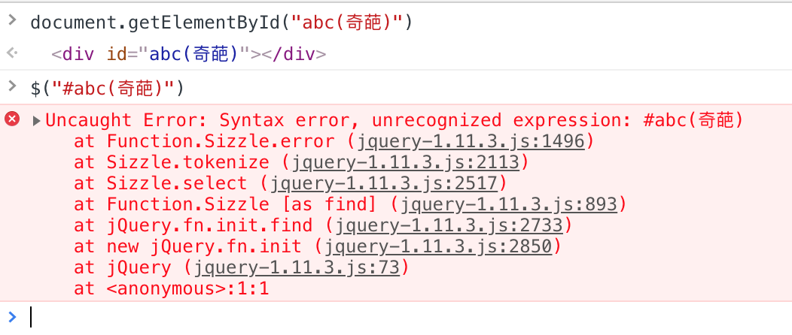

# IDSelector

## 1. 代码复现
id属性为`abc(奇葩)`的元素，使用以下方法获取，得到不同结果：

* **document.getElementById**

```
document.getElementById("abc(奇葩)")
```

* **jQuery的$("#id")**

```
$("#abc(奇葩)")
```

运行结果如下：



反而是兼容性更好的jQuery出了错，究竟是为什么呢？

## 2. 文档解读
#### 2.1 文档手册
* 中文版：[id选择器](https://www.jquery123.com/id-selector/)
* 原版：[id-selector](https://api.jquery.com/id-selector/)

#### 2.2 原因
官方文档中指出，document.getElementById()是非常高效的，但是当id选择器还附着其他的选择器时，比如`h2#pageTitle`，为了能够匹配元素，jQuery在识别此元素前进行了更多的优化。

#### 2.3 方案
如果id包含.或[ ]等特殊符号，需要用反斜杠转译。文档中给出了 [示例说明](./190513-id-with-characters.md)

## 3. 解决方案

#### 3.1 字符转译

```javascript
$("#abc\\(奇葩\\)")
```

#### 3.2 属性选择器

```javascript
$("[id='abc(奇葩)']")
```